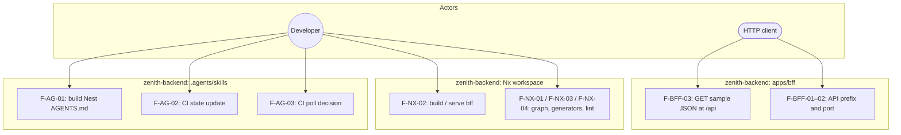
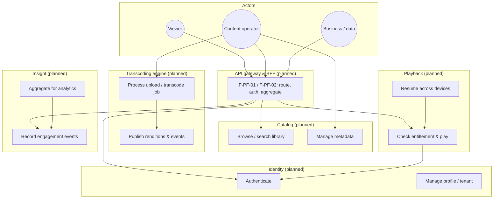
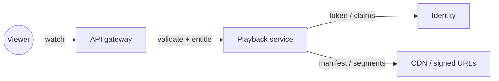
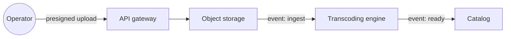

# Zenith Backend — Features and Use Cases

**Language:** English (consistent with all files under `docs/planning/`).

This document catalogs **features**: observable capabilities from a product or operator perspective. It separates what the **`zenith-backend` repository implements today** from the **target Zenith platform** described in [1_overview.md](./1_overview.md). For dependency versions and infrastructure choices, see [3_techstack.md](./3_techstack.md).

---

## 1. How to read this document

| Layer                              | Content                                                                                                                              |
| ---------------------------------- | ------------------------------------------------------------------------------------------------------------------------------------ |
| **§2 — Implemented today**         | Features backed by code in this repo (minimal BFF, Nx workspace, agent tooling).                                                     |
| **§3 — Planned platform features** | End-state capabilities aligned with the microservice catalog in the overview; not yet implemented as separate services in this tree. |
| **§4 — Traceability**              | Maps features to repositories / apps when known.                                                                                     |

Use case diagrams use [Mermaid](https://mermaid.js.org/) `flowchart` notation (widely supported in GitHub, GitLab, and VS Code). Actors use `((Name))`; use cases use `[Label]`; the BFF box groups current runtime scope.

---

## 2. Implemented features (this repository)

These capabilities exist in **`zenith-backend`** as of the planning baseline.

### 2.1 Runtime — BFF HTTP API (`apps/bff`)

| ID           | Feature                      | Description                                                                                                          | Primary surface                       |
| ------------ | ---------------------------- | -------------------------------------------------------------------------------------------------------------------- | ------------------------------------- |
| **F-BFF-01** | **Global API prefix**        | All HTTP routes are mounted under the `/api` prefix.                                                                 | `main.ts` (`setGlobalPrefix('api')`). |
| **F-BFF-02** | **Configurable listen port** | Server binds to `process.env.PORT` or **3000** by default.                                                           | `main.ts`.                            |
| **F-BFF-03** | **Sample JSON endpoint**     | `GET /api` returns a static JSON payload `{ "message": "Hello API" }` for smoke checks and scaffolding verification. | `AppController` → `AppService`.       |
| **F-BFF-04** | **NestJS bootstrap**         | Application starts via `NestFactory.create(AppModule)` with startup logging.                                         | `main.ts`, `AppModule`.               |

**Non-features (explicit gaps):** authentication, authorization, persistence, file upload, transcoding, catalog, playback state, analytics, OpenAPI, rate limiting, and CORS policy are **not** implemented in the Nest app yet.

### 2.2 Engineering — Nx monorepo

| ID          | Feature                   | Description                                                                                                             |
| ----------- | ------------------------- | ----------------------------------------------------------------------------------------------------------------------- |
| **F-NX-01** | **Graph-aware workspace** | Nx **22.7.1** workspace `@zenith-backend/source` with Nest and Webpack plugins.                                         |
| **F-NX-02** | **Build and serve `bff`** | Targets `build` (Webpack production bundle) and `serve` (`@nx/js:node` after build) defined in `apps/bff/project.json`. |
| **F-NX-03** | **Generator defaults**    | `@nx/nest:application` and `@nx/node:application` default `unitTestRunner` and `e2eTestRunner` to `none` in `nx.json`.  |
| **F-NX-04** | **Lint graph**            | ESLint plugin integration for projects (flat config at repo and app level).                                             |

### 2.3 Tooling — Agent skills (`.agents/skills/`)

| ID          | Feature                           | Description                                                                                                                                 |
| ----------- | --------------------------------- | ------------------------------------------------------------------------------------------------------------------------------------------- |
| **F-AG-01** | **Nest best-practices doc build** | `nestjs-best-practices/scripts/build-agents.ts` aggregates Markdown rules into a single `AGENTS.md` for LLM/agent guidance.                 |
| **F-AG-02** | **CI state transitions**          | `monitor-ci/scripts/ci-state-update.mjs` implements `gate`, `post-action`, and `cycle-check` commands with JSON stdout for hook automation. |
| **F-AG-03** | **CI poll decision engine**       | `monitor-ci/scripts/ci-poll-decide.mjs` classifies CI/self-heal state into `poll`, `wait`, or `done` actions with backoff and messages.     |

These scripts support **developer workflow** and **CI monitoring**; they are not user-facing product APIs.

### 2.4 Use case diagram — current repository scope

Actors: **HTTP client** (any consumer of the API), **developer** (runs Nx and scripts).

---

## 3. Planned platform features (target ecosystem)

These features match the **Zenith** vision in [1_overview.md](./1_overview.md). They are **roadmap** items; most are **not** present as Nest modules in `zenith-backend` yet. When an capability lands in code, add it to **§2** and keep a short pointer here.

### 3.1 By service (capability matrix)

| Service                | Feature themes (use-case level)                                                                                                                 |
| ---------------------- | ----------------------------------------------------------------------------------------------------------------------------------------------- |
| **Identity**           | Register and sign-in; token issue and validation; profiles; tenant/org boundaries; token consumption by gateway and services.                   |
| **Catalog**            | Browse and search library; titles, seasons/episodes, categories; artwork and metadata; integration with search index updates via events.        |
| **Transcoding engine** | Ingest masters; FFmpeg-based ladder and packaging (HLS/DASH); thumbnails; emit **transcode completed**; scale workers with queue back-pressure. |
| **Playback**           | Entitlement checks; playback session; resume across devices; hot state and durable progress (design-dependent).                                 |
| **Insight**            | Ingest engagement events; aggregate for BI; export or stream to warehouse/OLAP (optional).                                                      |

### 3.2 Cross-cutting platform features

| ID          | Feature                     | Notes                                                                              |
| ----------- | --------------------------- | ---------------------------------------------------------------------------------- |
| **F-PF-01** | **API gateway**             | TLS, routing, authn, coarse authz, rate limiting, request IDs.                     |
| **F-PF-02** | **BFF / aggregation**       | Tailored APIs for Next.js clients without exposing every internal RPC.             |
| **F-PF-03** | **Saga-style coordination** | Distributed workflows (e.g. subscription → entitlement) with idempotent consumers. |
| **F-PF-04** | **Resilience**              | Timeouts, circuit breaking, bulkheads, controlled degradation.                     |
| **F-PF-05** | **Observability**           | Traces, structured logs, RED/USE metrics for SLOs.                                 |
| **F-PF-06** | **Media pipeline**          | Presigned upload, object storage, CDN-oriented segment delivery.                   |

### 3.3 Use case diagram — target product (high level)

**Diagram notes:** arrows show primary **dependencies** (who invokes whom at a conceptual level), not every event flow. Upload orchestration and async events (for example **UploadReceived** → transcoding → catalog update) are simplified into **Transcoding** and **Catalog** boundaries; see request paths in [1_overview.md](./1_overview.md) §3.2.

### 3.4 Use case diagram — playback read path (conceptual)

### 3.5 Use case diagram — upload / transcode write path (conceptual)

---

## 4. Traceability and maintenance

| When                                                                          | Action                                                                                                                             |
| ----------------------------------------------------------------------------- | ---------------------------------------------------------------------------------------------------------------------------------- |
| New **user-visible** or **operator** capability ships in `apps/*` or `libs/*` | Add a row under **§2** with a stable feature ID (`F-BFF-xx` or service prefix); extend **§3** only if the roadmap wording changes. |
| New **script-only** workflow                                                  | Add under **§2.3** and extend the diagram in **§2.4** if relationships change.                                                     |
| Architecture rename (e.g. split BFF)                                          | Update diagrams and **§4** pointers; keep [1_overview.md](./1_overview.md) as the source of truth for service names.               |

**Code-level inventory** (every Nest module, method, and script function name) is intentionally **not** duplicated here; if the team needs that level of detail again, regenerate a dedicated “source inventory” doc or derive it from the codebase search in CI.

---

## 5. Related documents

- [1_overview.md](./1_overview.md) — vision, service catalog, data ownership, distributed patterns.
- [3_techstack.md](./3_techstack.md) — stack, versions, and evolution from current monorepo to target.
